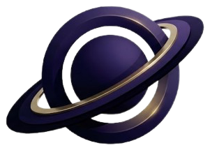

<p align="center">
  
</p>

<h1 align="center">Nova</h1>

<p align="center">
  <strong>Connecting people through <em>why</em> they listen, not <em>what</em> they listen to.</strong>
</p>

<p align="center">
  Built for HackGT — Meta Track: <em>Improving social connection using AI.</em>
</p>

---

## Overview

Most music apps introduce people by what's in their library: same songs, same artists, same
genre. That's a weak signal. Two people can love completely different songs for the exact same
reason — one person puts on something quiet because they need space, another reaches for
something loud for that same need. Their taste doesn't overlap at all, but the *role* the song
plays in their life does.

Nova connects people on that instead: **different songs, same reason.** You describe what a song
means to you — not with an essay, just a mood position and a couple of feelings — and an LLM finds
people who listen the way you do, then explains exactly why with evidence from both of your real
picks. Not a compatibility score. A reason to actually say something.

## How it works

1. **Pick a few songs that mean something to you.** Search the real catalog (Deezer/iTunes), no
   Spotify account required.
2. **Say how each one feels.** Drop a pin on a mood circle (how positive, how energetic) and pick
   1–3 feelings from a shared vocabulary — *aching*, *defiant*, *weightless*, *homesick*, and more,
   grouped by the kind of moment you reach for that song in.
3. **Get a listening portrait.** An LLM reads your picks into a short, AI-written read on what your
   music says about you — private, shown only to you.
4. **Enter the Galaxy.** You're placed in a bounded, living neighborhood of other listeners — not
   a directory of everyone, just you, your closest matches, a few distant strangers, and newcomers.
   Hop into anyone's neighborhood to explore outward from them instead.
5. **Get a Connection Card.** When there's a real match, the AI writes a card citing the actual
   songs from both of your profiles that prove it, one honest difference worth bringing up, and a
   suggested opener — so the first message isn't the hard part.
6. **Start talking.** Send the suggested opener, or break the ice with a **Song Swap**: send an
   actual track with a one-line reason, even clipping the exact few seconds you want them to hear.

## Key features

- **Meaning-based matching.** Matching runs on the emotional reason behind a song plus its
  AI-generated meaning — never on genre, artist, or shared taste.
- **Real evidence, not a vibe.** Every Connection Card cites real songs from both people's actual
  picks; the AI checks its own citations against the database before a card is ever shown.
- **The score is computed, not guessed.** Asking an LLM for a raw 0–100 match score makes it guess
  (in testing, it gave nearly everyone an 85). Nova asks structured, categorical questions instead
  and computes the final score in code.
- **Wander.** Find someone who picked the *exact same song* as you but felt the complete opposite
  way about it — a deliberately different question from matching.
- **Song Swap.** Send someone a real song with a reason, and a clipped favorite-part snippet they
  can hear right from the chat.
- **Emergent clusters, not a fixed list.** The galaxy's listening-motivation groups are discovered
  from real data (HDBSCAN over everyone's picks), not hand-picked categories.
- **Privacy by design, enforced at the database.** Row-Level Security means a person's private
  picks and listening portrait are only ever an *input* to a match decision, never something the
  other person — or a bug in a route handler — can read directly.

## Tech stack

| Layer | Technology |
|---|---|
| Framework | [Next.js](https://nextjs.org/) 16 (App Router) — one codebase for the frontend and the backend |
| Language | TypeScript, React 19 |
| Styling | Tailwind CSS, shadcn/ui (Base UI) |
| Galaxy visualization | Three.js, React Three Fiber + drei, d3-force-3d for layout, an SVG fallback for reduced motion / no WebGL |
| Database | [Supabase](https://supabase.com/) (Postgres) with Row-Level Security throughout |
| Vector search | [pgvector](https://github.com/pgvector/pgvector) — cosine similarity over 770-dim pick vectors |
| Clustering | Self-implemented HDBSCAN over pick vectors, for the galaxy's listening-motivation groups |
| Auth | Supabase Auth — email/password and Google OAuth |
| AI / LLM | [Google Gemini](https://ai.google.dev/) (`gemini-flash-latest` with a faster fallback/hedge model) for listening portraits, connection judgment, and contrast cards — always structured/JSON output, never a free-form score |
| Embeddings | `gemini-embedding-001`, truncated to 768 dimensions, one embedding per unique song, shared across every user who picks it |
| Song identity | [MusicBrainz](https://musicbrainz.org/) (primary), Gemini (fallback) |
| Song search & previews | Deezer Search API (primary), iTunes Search (fallback), 30-second previews |
| Album art | Cover Art Archive → iTunes → Deezer, cascading fallback |
| Hosting | [Vercel](https://vercel.com/), auto-deployed from `main` |

### Architecture, in short

1. **Song identity:** a typed title/artist is resolved through MusicBrainz into a canonical song
   (Gemini as a fallback), so the same real song is only ever represented once.
2. **One embedding per song:** Gemini embeds each unique song exactly once, reused by everyone.
3. **A vector per *pick*, not per person:** each pick's vector is that song's embedding plus the
   picker's mood, weighted so the song's meaning leads. Nothing is averaged into a single
   profile-level vector — that would let a person's unrelated happy songs bury the one song that's
   actually about their grandmother.
4. **Candidate retrieval:** pgvector's cosine similarity finds promising pairs cheaply, no AI cost.
5. **AI judgment:** Gemini reads both people's full public profiles and portraits, and either
   returns 1–2 evidenced threads plus a card, or rejects the pair outright. The 0–100 score is
   computed from Gemini's categorical answers, never asked for directly.
6. **Caching:** accepted cards are stored and reused; rejected pairs are remembered so they aren't
   re-judged on every page load.

## Getting started

```bash
npm install
cp .env.local.example .env.local   # Supabase, Gemini, and a MusicBrainz contact email
npm run dev
```

With Supabase keys set, the app requires sign-in and uses the real backend. To try the UI on demo
data without signing in:

```bash
NEXT_PUBLIC_SUPABASE_URL= NEXT_PUBLIC_SUPABASE_ANON_KEY= npm run dev
```

See `CLAUDE.md` for the full architecture, schema, and conventions, and `db/contract.md` for exact
table shapes and RPCs.

## Future work

- **Bonds.** Song Swaps already work; a bond that visibly strengthens (a brighter galaxy link) as
  two people keep trading songs is next.
- **Constellations.** Small group chats of 3–5 people who share the same reason for listening.
- **Realtime messaging** over the current polling-based chat.

## Team

- Anish Swaminathan
- Daniel Julius Stein
- James Armendariz
- Nguyễn Quốc Bảo An
